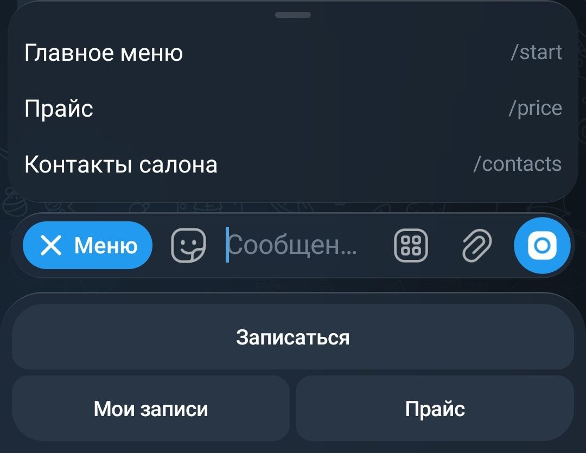
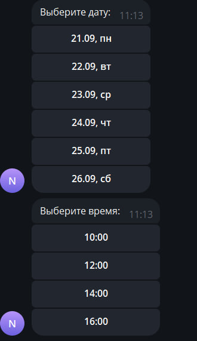
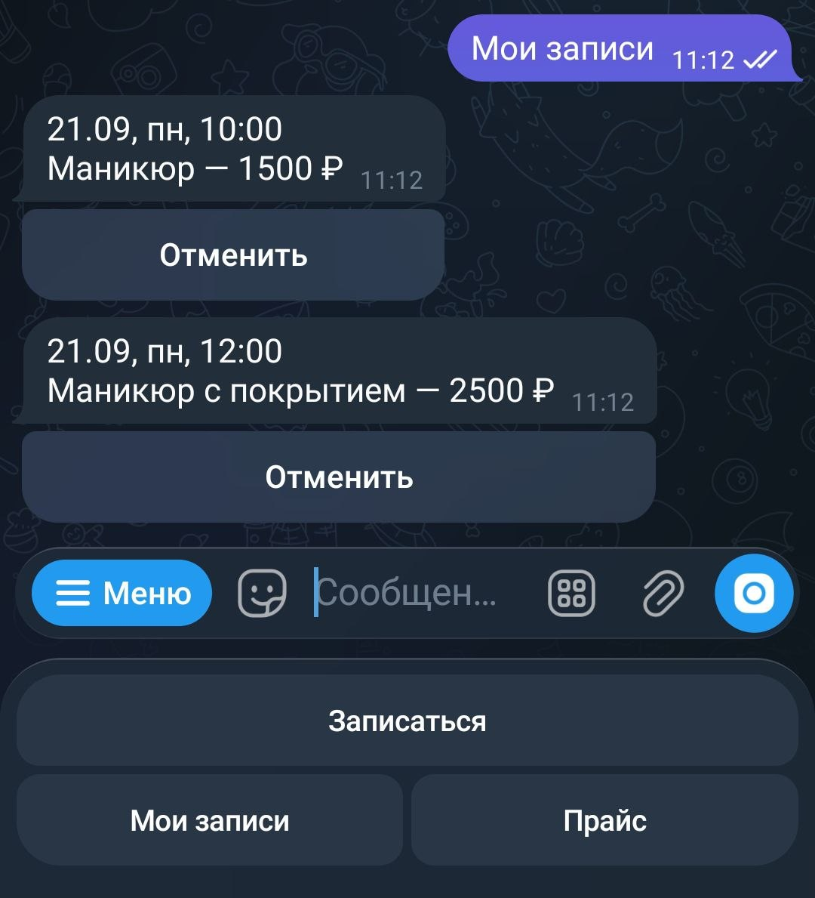

# Nail Master Bot

[](https://github.com/bno4a/nail-master-bot/actions/workflows/ci.yml)

Telegram-бот для записи на маникюр к одному мастеру. Клиент выбирает услугу, дату и время из свободных слотов, а мастер получает уведомления о новых записях и отменах.

## Возможности

**Для клиента**
- `/start` — приветствие и меню: «Записаться», «Мои записи», «Прайс»
- Запись в четыре шага: услуга → дата → свободное время → подтверждение
- «Мои записи» — список предстоящих записей с кнопкой «Отменить»
- «Прайс» — список услуг с ценами
- Напоминание о записи за день

**Для мастера** (определяется по telegram id из конфигурации)
- Уведомление о каждой новой записи и о каждой отмене
- `/today` — записи на сегодня

Салон работает с 10:00 до 19:00, слоты по 2 часа, выходной — воскресенье. Запись открыта на 7 дней вперёд. Всё это настраивается в `application.yml`.

Занять одно и то же время дважды нельзя: в таблице `appointments` стоит уникальное ограничение на пару «дата + время», а бот показывает понятное сообщение, если слот успели занять.

## Скриншоты

| Меню | Выбор времени | Мои записи |
|---|---|---|
|  |  |  |

## Стек

- Java 17, Spring Boot 3.5, Maven
- PostgreSQL 16, Spring Data JPA (Hibernate), Flyway
- TelegramBots 6.9 (long polling)
- Lombok
- JUnit 5, Mockito, AssertJ, Testcontainers
- Docker и Docker Compose

## Структура проекта

```
src/main/java/com/kazancev/nailbot/
├── bot/         NailBot, Keyboards, BookingState, Formats
├── service/     AppointmentService, SlotService, ClientService, ReminderService
├── repository/  Spring Data JPA репозитории
├── entity/      Client, ServiceItem, Appointment
└── config/      BotConfig, SalonProperties

src/main/resources/db/migration/
├── V1__init.sql              таблицы clients, services, appointments
└── V2__insert_services.sql   стартовый прайс
```

Схему базы ведёт Flyway, миграции применяются при старте приложения. Hibernate работает в режиме `ddl-auto: validate` — он ничего не создаёт и не меняет, только проверяет, что таблицы совпадают с сущностями, и падает при старте, если нет.

Шаг, на котором находится пользователь во время записи, хранится в `ConcurrentHashMap` в памяти бота.

## Запуск

Нужны Docker и Docker Compose.

1. Создай бота у [@BotFather](https://t.me/BotFather) и получи токен. Свой telegram id можно узнать у [@userinfobot](https://t.me/userinfobot).
2. Скопируй `.env.example` в `.env` и заполни значения:
   ```
   DB_PASSWORD=...
   BOT_TOKEN=...
   BOT_USERNAME=...
   MASTER_TELEGRAM_ID=...
   TZ=Asia/Irkutsk
   ```
3. Запусти:
   ```bash
   docker compose up -d --build
   ```
4. Напиши боту `/start`.

Логи приложения:
```bash
docker compose logs -f app
```

Остановить (данные сохранятся):
```bash
docker compose down
```

## Разработка

Поднять только базу, а приложение запускать из IDE:
```bash
docker compose up -d postgres
```
Переменные окружения `DB_PASSWORD`, `BOT_TOKEN`, `BOT_USERNAME` и `MASTER_TELEGRAM_ID` нужно задать в конфигурации запуска IDE.

Тесты:
```bash
./mvnw test
```

Юнит-тесты на моках проверяют расчёт слотов и правила отмены. Интеграционные тесты поднимают настоящий PostgreSQL 16 через Testcontainers, накатывают на него те же миграции Flyway, что и в проде, и проверяют то, что на моках проверить нельзя:

- `BookingConcurrencyTest` — восемь клиентов одновременно бьются за один слот: запись получает ровно один, остальные видят «время занято»;
- `AppointmentServiceIntegrationTest` — уникальное ограничение на пару «дата + время», производные запросы Spring Data (свои записи с сегодняшнего дня, отсортированные) и стартовый прайс из миграции.

Заодно на этих тестах отрабатывает `ddl-auto: validate` — если сущность разойдётся со схемой, контекст не поднимется и тесты упадут.

Для интеграционных тестов нужен запущенный Docker: Testcontainers поднимает контейнер сам.

На каждый push и pull request в `main` GitHub Actions прогоняет `./mvnw verify` (на раннерах Docker есть, так что Testcontainers работает без настройки) и отдельно собирает Docker-образ.

## Настройки

| Параметр | Значение по умолчанию | Описание |
|---|---|---|
| `salon.work-start` | `10:00` | Начало рабочего дня |
| `salon.work-end` | `19:00` | Конец рабочего дня |
| `salon.slot-duration` | `2h` | Длительность одного слота |
| `salon.day-off` | `SUNDAY` | Выходной |
| `salon.booking-days` | `7` | На сколько дней вперёд открыта запись |
| `bot.reminder-cron` | `0 0 18 * * *` | Когда рассылать напоминания на завтра |

Токен бота и пароль базы передаются только через переменные окружения.
